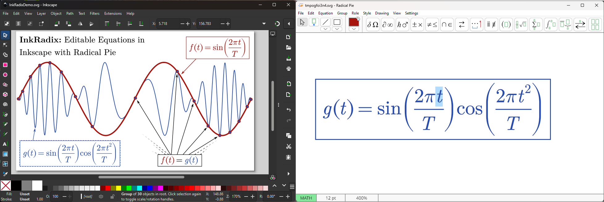

# <div align="center">
<p align="center">
  
</p>
</div>
<div align="center">
<p align="center">
  
</p>
</div>

InkRadix is an Inkscape extension that enables editing equations using Radical Pie™ (https://radicalpie.com/). Radical Pie is a commercial and propriatery WYSIWYG equation editing application for Windows 10/11.

# Installation
There are several ways to install InkRadix. First, make sure that [Radical Pie](https://radicalpie.com) and [Inkscape](https://inkscape.org/) are installed on your computer.

## Option 1: Easiest (Downloads and installs)
If you have Windows version 10 1803 or later (very likely), you can install easily with:
1. Open a Command Prompt
2. Copy, paste, and execute the following command:
```
(if exist "%temp%\InkRadixInst" rmdir /s /q "%temp%\InkRadixInst") && md "%temp%\InkRadixInst" && curl -L -o "%temp%\InkRadixInst\main.zip" "https://github.com/nasosi/InkRadix/archive/refs/heads/main.zip" && powershell -Command "Expand-Archive -Path '%temp%\InkRadixInst\main.zip' -DestinationPath '%temp%\InkRadixInst' -Force" && cd /d "%temp%\InkRadixInst\InkRadix-main\Resources" && call Install.bat && cd /d "%temp%" && rmdir /s /q "%temp%\InkRadixInst"
```
3. (Re)start Inkscape to load the extension.
   
## Option 2: Installer script
1. Download this repository [here](https://github.com/nasosi/InkRadix/archive/refs/heads/main.zip).
2. Extract it.
3. Execute the ```Install.bat``` script from the ```Resources``` folder.
4. (Re)start Inkscape to load the extension.

## Option 3: Manual
1. Download this repository [here](https://github.com/nasosi/InkRadix/archive/refs/heads/main.zip).
2. Place the files ```InkRadix.inx``` and ```InkRadix.py``` in the following user directory: ```%APPDATA%\inkscape\extensions``` You can copy and paste this path directly into the Windows File Explorer address bar. It will resolve to a folder similar to: ```C:\Users\<YourUsername>\AppData\Roaming\inkscape\extensions```
3. (Re)start Inkscape to load the extension.

## Option 4: From within Inkscape
1. Download this repository [here](https://github.com/nasosi/InkRadix/archive/refs/heads/main.zip).
2. In Inkscape, select ```Extensions``` → ```Manage Extensions```
3. In the Extensions window that appears, select the ```Install Packages``` tab.
4. At the bottom of the window, select the folder icon.
5. Navigate to the location where  ```InkRadix-main.zip``` was download it, select it and click ```Open``` at the bottom right of the window.
6. Close the Extensions window and restart Inkscape.

# Usage
The extension adds a menu entry under ```Extensions``` → ```Text``` → ```Radical Pie Equation```.

- **Adding a new equation**: If no objects are selected, the extension will launch Radical Pie. After closing and saving, a new equation will be inserted into Inkscape.
- **Editing an existing equation**: If an existing Radical Pie equation is selected, running the command will open it for editing. After closing and saving, the selected object will be updated with the modified content.
- If you select multiple equations and run the extension command, only the first equation will be edited.
- You can **paste LaTeX** equations into Radical Pie, and they will be formatted automatically. You can then modify them graphically.
- If you want a **LaTeX-like appearance**, you can install the NewCM-Radix font collection (https://github.com/nasosi/NewCM-Radix
), which works seamlessly with Radical Pie.
- Use the Inkscape pivot cursor to indicate the intended **alignment anchor**. InkRadix will automatically reference this pivot relative to the nearest bounding box anchor of the equation object (e.g., top-left, middle-right, etc.). A technical illustration of the algorithm is available [here](https://github.com/nasosi/InkRadix/blob/main/Resources/CloneAnchoredPose.pdf).
- ```Ctrl+Alt+Shift+E``` works well as a **keyboard shortcut**. To set it up, go to ```Edit``` → ```Preferences``` → ```Interface``` → ```Keyboard```, search for ```Radical Pie```, click on ```Radical Pie Equation```, and press ```Ctrl+Alt+Shift+E``` on your keyboard.
- Avoid ungrouping the equation object in Inkscape, as this will make it no longer editable. If this happens by accident, you can restore it using the Undo function. Occasionally, you may need to Undo and then Redo.
- When creating a new equation, InkRadix does not automatically load the user’s default design. To apply it, after Radical Pie starts, select ```Settings``` → ```Load User Default Design``` from the Radical Pie menu.

## Usage GIFs
## Creating a new equation


## Editing an existing equation


## Using the Inkscape pivot cursor for alignment


# Supported versions
InkRadix has been tested to work with Radical Pie versions 1.8 and 1.9, and Inkscape versions 1.0 through 1.4.
